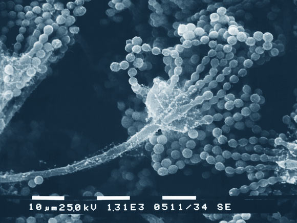

# Fungal Spore Exploder

  
   
  Image credit: Janice Haney Carr & Robert Simmons, CDC.

## Introduction

Have you ever wanted to make non-fungible tokens? What about non-fungal tokens?

With Fungal Spore Exploder you can quickly infect the internet with your hot new idea.

This repo provides a simple way to script the creation and destruction of NFTs on SLP.

## Setup

* Run `yarn install`
* Run `yarn build`
* Run `cp env.example .env`
* Create new wallet in Electron Cash SLP Edition named `fungal-spore-exploder`
* Send 0.01 BCH to address at index 0 in wallet (addresses tab)
* Right click on address 0 and get its private key, put it in `FUNDING_WIF` variable in `.env`

## Run

You can prefix these like `yarn -s` to hide yarn related output. 

You can then redirect the txid result to a file like `yarn -s start makegroup "testtoken" > testtoken.txid`

#### Each of these on success will result in a txid printed to console.

To use this, make a group token, mint some tokens, run split a few times, then start creating NFTs.

### Make Group Token

`yarn start makegroup NAME [SYMBOL DOCUMENTURI DOCUMENTHASH]`

### Mint Group Token

`yarn start mintgroup GROUP_TOKENID AMOUNT`

### Burn Group Token

Destroys all remaining group tokens and the minting baton.

`yarn start burngroup GROUP_TOKENID`

### Split Group

Creates 1 sized utxos so we can actually create NFTs

`yarn start splitgroup GROUP_TOKENID`

### Make NFT

Create a new NFT. Requires there to be a size 1 group utxo (created by `splitgroup` command)

`yarn start makenft GROUP_TOKENID NAME [SYMBOL DOCUMENTURI DOCUMENTHASH]`

### Burn NFTs

Pass list of tokenids to burn.

`yarn start burnnft TOKENID [TOKENID...]`
